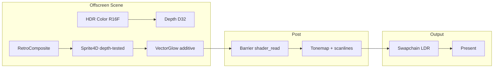

# Kengine

A modular C/C++ graphics engine prototype built around Vulkan, designed to transform retro 2D arcade-style games through a 4D spatial model. This is an early-stage reference implementation — not a production engine.

## Vision

Kengine explores how classic arcade aesthetics (Galaga, Geometry Wars, Death Tank) can be reimagined when gameplay and rendering operate in **4D space**, with smooth visual transitions between flat 2D projection and full 4D stereographic projection.

The focus is on maximizing core rendering features — bloom-ready HDR, depth, multithreading hooks, RAII resource management, spherical harmonics lighting — rather than advanced features like ray tracing.

---

## Design Principles

### 1. Explicitness and low-level Vulkan control

- Vulkan 1.3 with **Dynamic Rendering** (no render-pass/framebuffer boilerplate)
- RAII wrappers via Vulkan-Hpp (`vk::raii`)
- Command buffers recorded per frame; pipeline objects pre-warmed at startup
- **Pipeline cache** persisted to disk (`build/cache/kengine_pipeline_cache.bin`) to avoid compile hitches on relaunch
- VMA (Vulkan Memory Allocator) for sub-allocated GPU memory

### 2. Modular, component-based architecture

- **ECS registry** — lightweight entities with attachable components (`Transform`, `Mesh`, `Camera`, `Physics`, `RetroVisual`)
- **Layered design** — platform/windowing, Vulkan context, resources, scene, renderer, application logic
- **Service locator** for cross-cutting concerns (job system, future asset loading)
- **Job system** for worker-thread parallelism (scene updates, culling, streaming — hooks in place)

### 3. C23 for hot paths, C++20 for engine glue

| Layer | Language | Responsibility |
|-------|----------|----------------|
| `c_modules/math` | C23 | vec4, mat4, mat4d, Gauss-Legendre quadrature |
| `c_modules/sh` | C23 | Spherical harmonics basis, projection, evaluation |
| `c_modules/physics` | C23 | Velocity Verlet solver, spatial hash broadphase |
| `include/kengine/` | C++20 | Vulkan, ECS, render graph, pipelines, app |

C23 modules handle cache-friendly math and physics. C++ owns Vulkan lifetimes, type-safe RAII, and orchestration.

### 4. Data-oriented elements

- Structure-of-arrays friendly C modules for transforms and physics
- Per-frame-in-flight GPU resource sets (scene color, depth) to overlap CPU/GPU work
- Component pools in the ECS registry keyed by type ID

### 5. Render graph / frame graph

The frame is declared as a **directed acyclic graph** of passes:

```
geometry → [bloom] → [dof] → [taa] → [sharpen] → present
```

- Passes declare resource reads/writes; barriers are inserted at compile time
- Post-process passes (bloom, DOF, TAA, sharpen) are stubbed but wired to real offscreen handles
- `geometry` and `present` passes execute real GPU work today

### 6. Resource and memory management

- **VMA** sub-allocation — no per-resource `vkAllocateMemory`
- `GpuImage` RAII wrapper with `eSampled` usage reserved for future texture/bindless work
- Scene targets recreated on window resize
- Dedicated HDR color + depth images per frame in flight

### 7. 4D space and retro visual transition

- **4D positions** stored in `TransformComponent` and physics bodies (`ke_vec4`)
- **mat4d** (C23) — hyper-rotations in xw/yw/xy/zw planes, stereographic projection, 2D↔4D morph
- **Push constants** drive `w_morph` (0 = flat arcade, 1 = full 4D) and `w_slice` (cross-section offset)
- Retro style presets: `Galaga`, `GeometryWars`, `DeathTank` — palette and glow behaviour differ per style

### 8. Spherical harmonics lighting (PRT / IBL / light probes)

- **Bake pass** (CPU): Gauss-Legendre nodes in μ + uniform φ samples → SH coefficient projection
- **Runtime** (GPU stub): SH evaluation in fragment shaders; probe grid interpolation planned
- L=2 (9 coefficients per RGB channel)

### 9. Physics — low latency first

- Velocity Verlet integration (stable, low overhead)
- Spatial hash broadphase for collision candidate generation
- 4D gravity vector support in `ke_phys_world`

---

## Current Rendering Pipeline



| Stage | Format | Notes |
|-------|--------|-------|
| Scene color | `R16G16B16A16_SFLOAT` | HDR headroom for future bloom |
| Scene depth | `D32_SFLOAT` | 4D entity layering via projected Z |
| Swapchain | `B8G8R8A8_SRGB` | Tonemapped present pass |

Scene and present pipelines are **format-specific** (Vulkan dynamic rendering requirement) and cached separately.

---

## Project Structure

```
Kengine/
├── c_modules/           # C23 libraries
│   ├── math/            # vec4, mat4, mat4d, Gauss-Legendre
│   ├── sh/              # Spherical harmonics
│   └── physics/         # Verlet solver, spatial hash
├── include/kengine/     # C++20 public API
│   ├── core/            # Job system, service locator
│   ├── ecs/             # Entity-component registry
│   ├── math/            # Vec4d C++ wrappers
│   ├── physics/         # PhysicsWorld
│   ├── lighting/        # SH lighting system
│   ├── render/          # Frame graph, pipelines, frame renderer
│   ├── vulkan/          # Context, swapchain, VMA, GpuImage
│   └── app/             # Engine entry point
├── src/                 # Implementations
├── shaders/             # GLSL → SPIR-V (compiled at build time)
│   ├── retro/           # 2D/4D sprite, vector glow, composite
│   ├── post/            # Bloom, DOF, TAA, sharpen, tonemap
│   └── lighting/        # SH project/eval
└── cmake/               # Compiler flags, dependencies (GLFW, VMA)
```

---

## Dependencies

- **Vulkan SDK** 1.3+ (dynamic rendering, synchronization2)
- **CMake** 3.25+
- **C++20** and **C23** capable compiler (GCC 14+, Clang 21+)
- **glslc** (shader compiler, bundled with Vulkan SDK)
- Fetched at configure time: [GLFW](https://github.com/glfw/glfw), [VMA](https://github.com/GPUOpen-LibrariesAndSDKs/VulkanMemoryAllocator)

---

## Build and Run

```bash
mkdir build && cd build
cmake .. -DCMAKE_BUILD_TYPE=Release
cmake --build . -j$(nproc)
./kengine_demo
```

Shaders compile automatically to `build/shaders/`. The pipeline cache is written to `build/cache/kengine_pipeline_cache.bin` on clean shutdown.

### Debug build

```bash
cmake .. -DCMAKE_BUILD_TYPE=Debug
```

Validation layers are enabled by default when available.

---

## Configuration

`kengine::EngineConfig` (see `include/kengine/app/engine.hpp`):

| Option | Default | Description |
|--------|---------|-------------|
| `window_width/height` | 1280×720 | Initial framebuffer size |
| `vsync` | `true` | FIFO present mode |
| `frame_graph.enable_bloom` | `true` | Bloom pass (stub) |
| `frame_graph.enable_dof` | `true` | Depth of field pass (stub) |
| `frame_graph.enable_aa` | `true` | TAA pass (stub) |
| `pipeline_cache_path` | `build/cache/...` | Persistent pipeline cache file |

Retro style at runtime:

```cpp
engine.set_retro_style(kengine::RetroStyle::GeometryWars);
```

---

## Implemented vs. Planned

### Working now

- [x] Vulkan 1.3 instance/device with dynamic rendering
- [x] HDR offscreen scene targets + D32 depth
- [x] Retro/4D sprite pipelines with animated `w_morph`
- [x] Tonemap present pass (HDR → swapchain)
- [x] Persistent GPU pipeline cache
- [x] ECS registry with 4D transform components
- [x] C23 SH projection (CPU bake)
- [x] Velocity Verlet physics with spatial hash
- [x] Frame graph pass declaration with geometry/present execution
- [x] Window resize → target/pipeline recreate

### Next steps

- [ ] Bloom / DOF / TAA compute and fragment passes (stubs exist)
- [ ] Sprite texture atlases and bindless descriptor indexing
- [ ] GPU SH bake compute pass
- [ ] Multi-threaded command buffer recording
- [ ] GPU frustum/occlusion culling with indirect draw
- [ ] Full 4D hyper-rotation matrix library
- [ ] Light probe grid interpolation at runtime

---

## License

Prototype — no license specified yet.